# Style Transfer

### Overview
This repository is a simplified implementation of [Unpaired Image-to-Image Translation using Cycle-Consistent Adversarial Networks](https://arxiv.org/abs/1703.10593).  

### Table of contents
1. [About Generative Adversarial Networks](#about-generative-adversarial-networks)
   * [Generator](#generator)
   * [Discriminator](#discriminator)
2. [About CycleGAN](#about-cyclegan)
3. [Installation and Usage](#installation-and-usage)
    * [Clone and install requirements](#clone-and-install-requirements)
    * [Download pretrained weights](#download-pretrained-weights)
    * [Download dataset](#download-dataset)
4. [Test](#test)
5. [Train](#train)
    * [Example](#example)
    * [Resume training](#resume-training)
6. [Credit](#credit)

### About Generative Adversarial Networks
Generative Adversarial Networks, or GANs for short, are tasks in which a model can generate new examples which
could have been drawn from the original dataset.

GANs are constructed from two neural nets:

#### Generator
The generator is a net which generates new data based on the dataset. Its goal is to "trick" the discriminator
into predicting its outputs as real data.

The net inputs a random noise vector $(z)$, and generates an image from it.

#### Discriminator
The discriminator is a net which discriminates between real and fake data of a certain domain. Given an image,
the discriminator will predict whether the image is real or fake.

The net inputs an RGB image, and outputs a probability.

### About CycleGAN
We've seen the description for GANs, in the paper, a new architecture is presented, CycleGAN.

The CycleGAN architecture works in such a way that the mapping is learned on both directions. 
So, if in a regular GAN model we learn a mapping $(X -> Y)$, in CycleGAN we also learn the mapping $(Y -> X)$.

The forward mapping generator is notated as $(G)$, and the backward one as $(F)$.

### Installation and Usage

#### Clone and install requirements

```bash
$ git clone https://github.com/CS-FinalProject/StyleTransfer.git
$ cd StyleTransfer/
$ pip3 install -r requirements.txt
```

#### Download dataset

```bash
$ ./data/get_dataset.sh
```

### Test

The following commands can be used to test the whole test.

```bash
$ python3 test.py --cuda
```

For single image processing, use the following command:

```bash
$ python3 test_image.py --file assets/horse.png --model-name weights/horse2zebra/netG_A2B.pth --cuda
```

InputA --> StyleB  --> RecoveryA

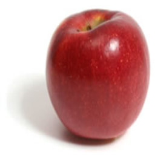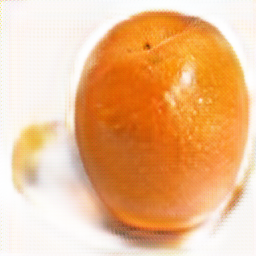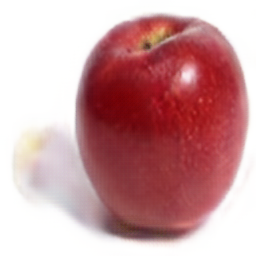
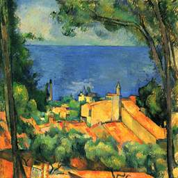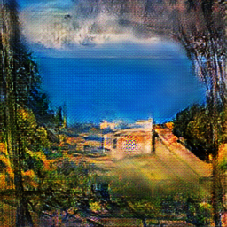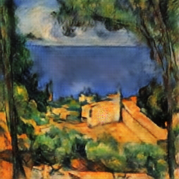
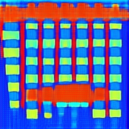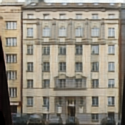
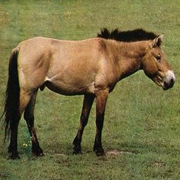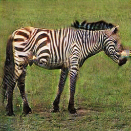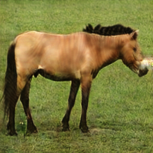

### Train

```text
usage: train.py [-h] [--dataroot DATAROOT] [--dataset DATASET] [--epochs N]
                [--decay_epochs DECAY_EPOCHS] [-b N] [--lr LR] [-p N] [--cuda]
                [--netG_A2B NETG_A2B] [--netG_B2A NETG_B2A] [--netD_A NETD_A]
                [--netD_B NETD_B] [--image-size IMAGE_SIZE] [--outf OUTF]
                [--manualSeed MANUALSEED]

PyTorch implements `Unpaired Image-to-Image Translation using Cycle-Consistent
Adversarial Networks`

optional arguments:
  -h, --help            show this help message and exit
  --dataroot DATAROOT   path to datasets. (default:./data)
  --dataset DATASET     dataset name. (default:`horse2zebra`)Option:
                        [apple2orange, summer2winter_yosemite, horse2zebra,
                        monet2photo, cezanne2photo, ukiyoe2photo,
                        vangogh2photo, maps, facades, selfie2anime,
                        iphone2dslr_flower, ae_photos, ]
  --epochs N            number of total epochs to run
  --decay_epochs DECAY_EPOCHS
                        epoch to start linearly decaying the learning rate to
                        0. (default:100)
  -b N, --batch-size N  mini-batch size (default: 1), this is the total batch
                        size of all GPUs on the current node when using Data
                        Parallel or Distributed Data Parallel
  --lr LR               learning rate. (default:0.0002)
  -p N, --print-freq N  print frequency. (default:100)
  --cuda                Enables cuda
  --netG_A2B NETG_A2B   path to netG_A2B (to continue training)
  --netG_B2A NETG_B2A   path to netG_B2A (to continue training)
  --netD_A NETD_A       path to netD_A (to continue training)
  --netD_B NETD_B       path to netD_B (to continue training)
  --image-size IMAGE_SIZE
                        size of the data crop (squared assumed). (default:256)
  --outf OUTF           folder to output images. (default:`./outputs`).
  --manualSeed MANUALSEED
                        Seed for initializing training. (default:none)

```

#### Example

```bash
# Example: horse2zebra
$ python3 train.py --dataset horse2zebra --cuda
```

#### Resume training

If you want to load weights that you've trained before, run the following command.

```bash
# Example: horse2zebra for epoch 100
$ python3 train.py --dataset horse2zebra \
    --netG_A2B weights/horse2zebra/netG_A2B_epoch_100.pth \
    --netG_B2A weights/horse2zebra/netG_B2A_epoch_100.pth \
    --netD_A weights/horse2zebra/netD_A_epoch_100.pth \
    --netD_B weights/horse2zebra/netD_B_epoch_100.pth --cuda
```

### Credit

#### Unpaired Image-to-Image Translation using Cycle-Consistent Adversarial Networks
_Jun-Yan Zhu, Taesung Park, Phillip Isola, Alexei A. Efros_ <br>

**Abstract** <br>
Image-to-image translation is a class of vision and graphics problems where the goal 
is to learn the mapping between an input image and an output image using a training 
set of aligned image pairs. However, for many tasks, paired training data will not be 
available. We present an approach for learning to translate an image from a source 
domain X to a target domain Y in the absence of paired examples. Our goal is to learn 
a mapping G:X→Y such that the distribution of images from G(X) is indistinguishable
from the distribution Y using an adversarial loss. Because this mapping is highly
under-constrained, we couple it with an inverse mapping F:Y→X and introduce a cycle 
consistency loss to push F(G(X))≈X (and vice versa). Qualitative results are presented 
on several tasks where paired training data does not exist, including collection 
style transfer, object transfiguration, season transfer, photo enhancement, etc. 
Quantitative comparisons against several prior methods demonstrate the superiority
of our approach.

[[Paper]](https://arxiv.org/pdf/1703.10593)) [[Authors' Implementation]](https://github.com/junyanz/pytorch-CycleGAN-and-pix2pix)

```
@inproceedings{CycleGAN2017,
  title={Unpaired Image-to-Image Translation using Cycle-Consistent Adversarial Networkss},
  author={Zhu, Jun-Yan and Park, Taesung and Isola, Phillip and Efros, Alexei A},
  booktitle={Computer Vision (ICCV), 2017 IEEE International Conference on},
  year={2017}
}
```
